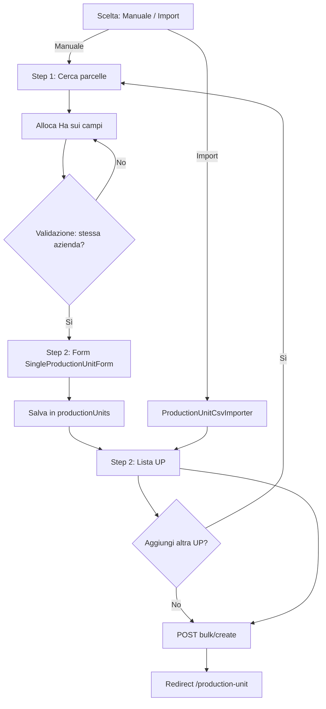
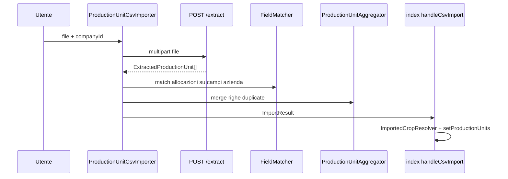

# Nuova Unità Produttiva — Flusso e API

Documentazione del wizard in `src/routes/ProductionUnit/NewProductionUnit/` per la creazione di **una o più unità produttive (UP)** in un’unica sessione.

**Base URL API:** `VITE_API_URL` (default `http://localhost:3000`), definita in `src/api/*.ts`.

### Indice

1. [Panoramica](#panoramica) · [Diagramma](#diagramma-del-flusso)
2. [Modalità manuale / import](#due-modalità-di-ingresso)
3. [Ettari e più campi](#ettari-e-superfici-una-up-più-campi)
4. [Split campo](#split-delle-allocazioni-stesso-campo-più-aree) · [Più UP in sessione](#gestione-di-più-up-nella-stessa-sessione)
5. [Dataset locali](#dataset-locali-non-api-backend)
6. [Step 1 — UI e bulk](#step-1-manuale--ui-filtri-e-azioni-bulk)
7. [Step 2 — Form](#step-2--coltura-cultivar-date-e-form)
8. [Import — pipeline client](#import--pipeline-lato-client)
9. [Navigazione UI](#navigazione-e-stati-ui)
10. [Frazionamento UP (dialog)](#dialog-frazionamento-up-splitproductionunitdialog)
11. [Cicli e AGEA](#cicli-colturali-e-campi-agea)
12. [Componenti legacy](#componenti-legacy-non-nel-flusso-attuale)
13. [API](#api-chiamate) · [Struttura file](#struttura-file-del-modulo) · [Tipi](#tipi-principali) · [Limitazioni](#limitazioni-e-comportamenti-da-tenere-presenti)

---

## Panoramica

Il flusso è un wizard a **2 step** orchestrato da `index.tsx`:

| Step | Contenuto |
|------|-----------|
| **0** (scelta iniziale) | Creazione manuale **oppure** import da file |
| **1** | Selezione parcelle e allocazione superfici (solo manuale) |
| **2** | Configurazione UP + lista UP create + submit finale |

Lo stato principale vive nel container:

- `productionUnits: ProductionUnitInput[]` — UP già confermate (bozze locali)
- `allocatedFields: Map<string, number>` — allocazioni in corso (chiave → ettari)
- `currentStep: 1 | 2`, `creationMode`, `step2ShowList`, `editingUnitId`

Le UP **non** vengono persistite sul backend fino al click su **“Crea N Unità Produttive”**, che invoca una sola chiamata bulk.

---

## Diagramma del flusso



---

## Due modalità di ingresso

### 1. Creazione manuale (`creationMode: "manual"`)

1. L’utente imposta **data inizio/fine** dell’UP e preme **Cerca**.
2. Viene caricata la disponibilità campi nel periodo (`GET /fields/availability`).
3. L’utente alloca ettari sulle parcelle (anche con **split** sullo stesso campo).
4. **Associa** → Step 2, form con coltura, cultivar, date, ecc.
5. **Aggiungi unità produttiva** → la UP entra in `productionUnits` e si torna alla lista.
6. **Aggiungi un’altra unità produttiva** → torna allo Step 1 con `allocatedFields` azzerato (i campi già usati nelle altre UP restano bloccati).

**Vincolo:** tutte le parcelle allocate per **una singola UP** devono appartenere alla **stessa azienda** (`canProceedToNextStep`).

### 2. Import da file (`creationMode: "import"`)

1. L’utente seleziona l’azienda e carica un file (CSV, XLS, XLSX, PDF, Shapefile, ZIP).
2. Il backend estrae le UP (`POST /production-units/extract`).
3. `handleCsvImport` converte il risultato in `ProductionUnitInput[]`, tenta il match coltura locale (`ImportedCropResolver`) e salta allo **Step 2 in vista lista**.
4. L’utente può modificare, frazionare, spostare campi tra UP, poi confermare con **bulk create**.

L’import **non** crea subito le UP sul server: solo estrazione + revisione locale, come nel flusso manuale.

---

## Ettari e superfici: una UP, più campi

Sì: **un’unità produttiva può includere più parcelle (campi)**, ciascuna con una **superficie allocata diversa** in ettari (Ha). Non è “un ettaro per UP”, ma la **somma** (e il dettaglio per campo) di tutte le allocazioni scelte in quella sessione.

### Modello in memoria

Ogni UP in bozza (`ProductionUnitInput`) espone le superfici così:

```typescript
allocations: Map<string, number>  // chiave allocazione → ettari (areaHa)
allocationsWithDetails?: FieldAllocation[]  // opzionale: nome, foglio, particella (soprattutto da import)
totalAreaHa?: number | null       // opzionale: totale esplicito (spesso da file importato)
```

| Concetto | Significato |
|----------|-------------|
| **Campo / parcella** | Entità con `fieldId` e `areaAvailable` (superficie ancora utilizzabile nel periodo scelto) |
| **Allocazione** | Quanti **Ha** di quel campo assegni **a questa UP** (può essere &lt; `areaAvailable`) |
| **SAU totale allocata** (Step 1) | Somma di tutti i valori in `allocatedFields` — mostrata nel footer come “SAU Totale Allocata” |
| **Superficie UP** (Step 2 / lista) | Di norma **somma** di `unit.allocations`; se presente `totalAreaHa` dall’import, può essere usato come riferimento |

**Esempio:** una sola UP con tre campi diversi:

| Campo | `areaAvailable` (periodo) | Allocato alla UP |
|-------|---------------------------|------------------|
| Parcella Nord | 12.50 Ha | 8.00 Ha |
| Parcella Sud | 5.20 Ha | 5.20 Ha (Max) |
| Vigneto Est | 3.00 Ha | 1.50 Ha |

→ `allocations` ha **3 voci**; superficie totale UP ≈ **14.70 Ha** (8 + 5.2 + 1.5). In API andranno **3** oggetti `{ fieldId, areaHa }` (dopo eventuale merge delle split sullo stesso `fieldId`).

### Step 1 — come si assegnano gli ettari (manuale)

1. Dopo **Cerca**, per ogni parcella vedi **“Disp. X.XX Ha”** = capacità residua nel periodo (`areaAvailable` meno occupazione già in altre UP della stessa sessione e meno altre allocazioni sullo stesso campo).
2. L’utente inserisce un numero nell’input o usa **Max** per allocare il massimo consentito per quella riga.
3. `updateFieldAllocation(fieldId, areaHa, allocationKey?)` salva in `allocatedFields` e **limita** il valore a `getAvailableCapacityForAllocation` (non si può superare la capacità).
4. Il footer **“SAU Totale Allocata”** è la somma di **tutte** le righe allocate (incluse le split sullo stesso campo fisico).
5. **Associa** copia `allocatedFields` nel form Step 2; al **Salva**, quella mappa diventa `unit.allocations` della UP.

Campi già usati in **altre** UP create nella stessa sessione non sono riallocabili: `getFieldsAlreadyUsedInPUs()` sottrae quegli Ha dalla disponibilità (l’UP in modifica è esclusa dal conteggio).

### Più campi vs. più UP

| | Una UP | Più UP nella stessa sessione |
|---|--------|------------------------------|
| Campi | **Più** `fieldId` (o chiavi split) nella stessa `allocations` | Ogni UP ha la **propria** `allocations` |
| Azienda | Tutti i campi della **stessa** UP devono essere della **stessa** `companyId` | Ogni UP può essere di un’azienda diversa (una UP = una azienda in manuale) |
| Ettari | Somma per UP | Le stesse parcelle non possono essere riusate oltre `areaAvailable` globale |

### Import da file

Il backend (`extract`) può restituire già **più allocazioni per UP** (`allocations` + `allocationsWithDetails`). Il client fa match parcella-per-parcella e può impostare `totalAreaHa` dal file. In lista e in submit si usano comunque le mappe per campo; se manca il match, compaiono warning e allocazioni “unmatched”.

### Cosa invia l’API al submit

Per ogni UP, le chiavi `fieldId__split__N` vengono **sommate sullo stesso `fieldId`**:

```typescript
// Esempio interno prima del POST
allocations: Map {
  "field-a" => 8.0,
  "field-b__split__2" => 1.0,
  "field-b__split__3" => 0.5,
}
// Payload bulk/create
allocations: [
  { fieldId: "field-a", areaHa: 8.0 },
  { fieldId: "field-b", areaHa: 1.5 },  // 1.0 + 0.5
]
```

Il backend riceve quindi **una riga per campo reale**, con l’**area totale** assegnata a quella UP su quel campo.

### Frazionamento di un’intera UP (non confondere con lo split campo)

**Split campo** (sezione sotto): stesso `fieldId`, più porzioni **nella stessa** UP (`__split__`).

**Fraziona UP** (`handleSplitUnit`): una UP esistente viene divisa in **N unità produttive distinte**; gli Ha di ogni campo vengono ripartiti **in proporzione** alla superficie della nuova UP (`distributeAllocationsProportionally`). Es.: UP da 10 Ha divisa in 6 Ha + 4 Ha → ogni campo perde il 40% o il 60% della propria allocazione originale.

---

## Split delle allocazioni (stesso campo, più aree)

Per dividere una parcella in più porzioni nella stessa UP si usano chiavi speciali nella `Map`:

| Chiave | Significato |
|--------|-------------|
| `{fieldId}` | Area principale (“Area 1”) |
| `{fieldId}__split__{n}` | Area indipendente n ≥ 2 |

Helper in `utils.ts`: `buildSplitAllocationKey`, `getBaseFieldIdFromAllocation`, `isSplitAllocationKey`.

In submit, le split vengono **riaggregate per `fieldId`** sommando gli ettari prima della chiamata API.

---

## Gestione di più UP nella stessa sessione

Dopo il salvataggio di ogni UP (`onSave` in `SingleProductionUnitForm`):

- La UP viene aggiunta o aggiornata in `productionUnits`.
- `step2ShowList = true` mostra l’accordion con tutte le UP.

Operazioni sulla lista (tutto in memoria, **nessuna API**):

| Azione | Handler | Effetto |
|--------|---------|---------|
| Modifica | `handleEditUnit` | Ripristina `allocatedFields` dalla UP e riapre il form |
| Elimina | `handleDeleteUnit` / `handleDeleteUnits` | Rimuove da `productionUnits` |
| Fraziona UP | `handleSplitUnit` | Sostituisce 1 UP con N UP; allocazioni ripartite proporzionalmente |
| Sposta campo | `handleMoveField` | Trasferisce un’allocazione tra due UP |
| Rimuovi campo | `handleRemoveFieldFromUnit` | Toglie un campo da una UP |

---

## Dataset locali (non API backend)

Caricati all’avvio della pagina, via `fetch` su asset statici:

| Risorsa | Hook | URL |
|---------|------|-----|
| Varietà colturali | `useCropVarieties` | `GET /datasets/varietà/index.json` |
| Catalogo cultivar / date raccolta | `useCultivarHarvestDates` | `GET /datasets/varietà/date_raccolta.csv` |

Usati per: select coltura, suggerimento data raccolta, auto-nome UP (`{species} - {campi}`).

---

## Step 1 (manuale) — UI, filtri e azioni bulk

Oltre all’allocazione per singola card, lo Step 1 espone:

| Funzione | Comportamento |
|----------|----------------|
| **Periodo** | `tempDateRange` in UI; **Cerca** copia in `dateRange` e abilita `GET /fields/availability` |
| **Reset** | Ripristina periodo all’anno corrente (`getCurrentYearRange`) |
| **Filtro azienda** | `selectedCompanyId`: `"all"` o un `companyId` — filtra `allFieldsWithSplits` |
| **Ricerca testuale** | `searchValue` su nome campo, indirizzo, città, nome azienda |
| **Checkbox multiselect** | `selectedFieldIds` — selezione visiva per azioni bulk (non alloca da sola) |
| **Alloca Max su selezionati** | Per ogni chiave selezionata chiama `allocateMaxForField(baseFieldId, allocationKey)` |
| **Rimuovi selezionati** | `removeFieldAllocation` + deseleziona |
| **Rimuovi tutte le allocazioni** | Svuota `allocatedFields` |

### Badge e stati parcella

Per ogni riga (campo base o split virtuale):

| Badge / stato | Significato |
|---------------|-------------|
| **Disp. X Ha** | `areaAvailable` − allocazioni correnti − Ha già in altre UP della sessione |
| **Campo già allocato** | `areaUsedInPUs >= areaAvailable` — card disabilitata |
| **X Ha in UP create** | Uso parziale in altre UP già salvate in `productionUnits` |
| **X Ha occ.** | `areaOccupied` dal backend (occupazione nel periodo) |
| **Allocato** / ring verde | Riga con Ha &gt; 0 nell’allocazione corrente |
| **Area 1 / Area N** | Split: badge da `getSplitDisplayLabel` |

Card **disabilitata** se campo esaurito o `allocationCapacity <= 0`.

### Lista campi virtuali (`allFieldsWithSplits`)

Per ogni campo reale da availability, la UI mostra:

1. La riga del campo (`id = fieldId`)
2. Una riga per ogni chiave `fieldId__split__N` già presente in `allocatedFields`

Così ogni porzione split ha input e Max dedicati.

---

## Step 2 — Coltura, cultivar, date e form

Componente: `SingleProductionUnitForm.tsx`. Due viste controllate da `showList` (prop da `step2ShowList`).

### Vista form (`showList === false`)

**Stato form:** `ProductionUnitFormStateFactory.build(editingUnitId)`:

- Nuova UP → `id: pu-${Date.now()}`, `allocations` = copia di `allocatedFields`
- Modifica → stessi metadati della UP, `allocations` aggiornate da `allocatedFields`

#### Coltura (`cropCode`)

- Select con ricerca su `species`, `cropType`, `code` (dataset JSON).
- Se **import** senza match: box amber con `importedCropName`, `importedCropType`, `importedVariety`; coltura locale **opzionale**.
- Cambio coltura → reset `cultivarId` e `importedVariety`; può resettare flag nome auto.

#### `ImportedCropResolver` (solo in `handleCsvImport`, non nel form)

Dopo extract, per ogni UP importata:

1. Costruisce etichette candidate: `cropName`, `cropType`, `occupazione`, `name` + testo senza parentesi + contenuto tra `(...)`.
2. Match fuzzy (normalizzazione NFD, lowercase) contro `species` e `cropType` del catalogo locale (`includes` bidirezionale).
3. Se trovato → `cropCode`; altrimenti `""` e toast warning sulle UP senza coltura.

#### Cultivar

- Se esiste `CultivarCatalog` e cultivar per la coltura: select da `getCultivarsForCrop(selectedCrop)`.
- Altrimenti: input libero su `importedVariety`.
- `CultivarCatalog` (CSV `;`): `id = species|cultivar`, `harvestLabel` tipo `15-set`, `offsetDays` opzionale.
- **`getRecommendedHarvestDate`**: parsa `harvestLabel` nell’anno di `dateRange.start`; se la data è prima di `startDate`, +1 anno; aggiorna `customHarvestingDate` finché l’utente non modifica manualmente (“Usa suggerita” per ripristinare).

#### Nome UP

- Auto: `{species} - {nomi campi}` (max 3 nomi + “e altri N”) quando c’è coltura locale e `!isNameManuallyEdited`.
- Input disabilitato finché non c’è `selectedCrop` (in import con solo dati backend il nome può essere già valorizzato dalla UP).

#### Calendario colturale (`calculateCropDates`)

Date nel dataset coltura in formato `gg-mm`. Logica in `utils.ts`:

1. Anno di riferimento = anno di `dateRange.start`.
2. Semina: se `sowingDate < startDate` → stesso giorno/mese **anno successivo**.
3. Fioritura: se &lt; semina aggiustata → anno successivo.
4. Raccolta: se &lt; fioritura aggiustata → anno successivo.

In form: `effectiveSowingDate` = `customSowingDate || defaultCropDates.sowingDate` (idem fioritura/raccolta). L’utente può sovrascrivere con i date picker.

#### Altri campi form

| Campo | Uso |
|-------|-----|
| `protectionStructure` | es. Serra, tunnel |
| `occupazione` | es. Principale, secondaria |
| `destinazioneDiUso` | Destinazione d’uso |
| `acquaTotalePeridoL` | Acqua totale periodo (L), numerico |

#### Validazione al Salva (`handleSave`)

| Regola | Errore |
|--------|--------|
| `name` vuoto | “Compila il campo Nome” |
| `!cropCode && !importedCropName` | “Seleziona una coltura” |
| OK | `onSave(formData)` → toast success |

Non valida esplicitamente che `allocations.size > 0` nel form (controllo al submit bulk).

### Vista lista (`showList === true`)

Vedi sezione “Gestione di più UP”. Footer:

- **Aggiungi un’altra unità produttiva** → `onAddAnother` (step 1, allocazioni azzerate)
- **Crea N Unità Produttive** → `onNext` = `handleCreateProductionUnits`

Ricerca lista: nome UP, coltura, dati parcellari, testo da `unit.cycles`.

---

## Import — pipeline lato client

Flusso in `ProductionUnitCsvImporter` → `handleCsvImport` in `index.tsx`.



### `POST /production-units/extract`

- PDF → `extractProductionUnitsWithProgress` (SSE/progress UI).
- Altri formati → `extractProductionUnits`.
- `AbortController` per annullare upload.

### `FieldMatcher`

Indicizza i campi dell’azienda selezionata con chiavi normalizzate (lowercase, trim):

| Chiave | Quando |
|--------|--------|
| `sezione\|foglio\|particella` | Se tutti presenti |
| `foglio\|particella` | Sempre se foglio+particella |

Match allocazione importata: prima chiave completa, poi corta. Senza foglio/particella → `null` → voce in `unmatchedAllocations`.

### `ProductionUnitAggregator`

Unisce UP estratte con stessa chiave logica:

`normalize(name) | normalize(occupazione) | startISO | endISO`

Somma `allocations`, `totalAreaHa`, unisce `matchedFieldIds` / `unmatchedAllocations`, tiene min `startDate` e max `endDate`.

### `handleCsvImport` (container)

| Passo | Azione |
|-------|--------|
| 1 | `setEntryMode("import")`, `setSelectedCompanyId(result.companyId)` |
| 2 | `ImportedCropResolver` → `cropCode` per ogni UP |
| 3 | Mappa in `ProductionUnitInput` (date → `customSowingDate` / `customHarvestingDate`, flag `imported*`) |
| 4 | Se ci sono date importate → `dateRange` e `tempDateRange` = min start, max end |
| 5 | `setProductionUnits`, `setCurrentStep(2)`, `setStep2ShowList(true)` |
| 6 | Toast success + warning se coltura non abbinata |

**Nota:** in modalità import lo Step 1 non viene mostrato; le allocazioni arrivano già dal file (con match dove possibile).

### `importerCompanies`

Costruito in `index.tsx` unendo:

- `registeredCompanies` da `GET /companies` (nome, VAT, id)
- `fields` da ultima risposta `fields/availability` (se già caricata), altrimenti `[]`

Serve all’importer per elenco aziende + campi usati dal `FieldMatcher`. In import puro senza aver mai cercato, i campi possono essere vuoti finché non c’è availability — il match parcellare dipende dai campi passati in prop.

---

## Navigazione e stati UI

| State | Ruolo |
|-------|------|
| `creationMode` | `null` = scelta iniziale; `"manual"` \| `"import"` |
| `currentStep` | `1` = parcelle (solo manual); `2` = form/lista |
| `step2ShowList` | `false` = form configurazione; `true` = accordion lista UP |
| `editingUnitId` | UP in modifica; esclusa da `getFieldsAlreadyUsedInPUs` |
| `entryMode` | `"search"` dopo Cerca; `"import"` dopo file |
| `hasPerformedSearch` | Gate per query availability |

| Azione | Effetto |
|--------|---------|
| **Annulla** (header) | `navigate(-1)` |
| **handleBackToChoice** | Reset: step 1, `productionUnits` [], allocazioni, edit, lista |
| **Associa** (step 1) | Valida azienda unica → step 2, `step2ShowList=false` |
| **Salva** (form) | Aggiorna/aggiunge UP → `step2ShowList=true` |
| **Indietro** (form) | Se edit → lista + clear `editingUnitId`; se nuova → step 1 |
| **Modifica** (lista) | Carica `unit.allocations` in `allocatedFields`, form senza lista |

---

## Dialog frazionamento UP (`SplitProductionUnitDialog`)

Aperto da lista UP (“Fraziona”). **Non** è lo split campo dello Step 1.

| Regola | Valore |
|--------|--------|
| Parti minime | 2 |
| Parti massime | 10 |
| Nomi default | `generateSplitUnitName` → base senza sufficio numerico + ` ${index+1}` |
| Validazione | `validateSplitSum`: somma `areaHa` delle parti = `totalAreaHa` ± **0.01** Ha |
| Conferma | `onSplitUnit(unitId, parts)` → N nuove UP, id `originalId__pu_split__{index}` |

Riparto allocazioni: `distributeAllocationsProportionally` — ogni `fieldId` moltiplicato per `partAreaHa / totalAreaHa`.

UI: slider/input per Ha per parte; aggiungi/rimuovi parti ricalcola quote uguali (ultima parte assorbe arrotondamenti).

---

## Cicli colturali e campi AGEA

### `cycles` (da extract / QuickCreate)

Tipo `ProductionUnitCycleDisplay[]` su `ProductionUnitInput`:

- `cycleIndex`, `cropName`, `cropType`, `variety`
- Mostrati nell’accordion lista (sezione “Cicli”), **non** inviati separatamente nel payload `bulk/create` attuale (solo campi flat crop/variety/date).

### Campi AGEA sulla UP

| Campo | Origine tipica | In `bulk/create` |
|-------|----------------|------------------|
| `occupazione` | Import / form | `occupazione` |
| `destinazioneDiUso` | Import / form | `destinazioneDiUso` |
| `acquaTotalePeridoL` | Import / form | `acquaTotalePeridoL` |
| `protectionStructure` | Import / form | `protectionStructure` |

---

## Componenti legacy (non nel flusso attuale)

Presenti nella cartella ma **non importati** da `index.tsx` (wizard attuale):

| File | Nota |
|------|------|
| `ConfirmationStep.tsx` | Step conferma standalone |
| `ImportedDataConfirmationStep.tsx` | Conferma dati import |
| `ProductionUnitsManagementStep/index.tsx` | Gestione UP multi-step alternativa |
| `Stepper.tsx` | Indicatore step 1–2 locale (commento “Stepper state” in index senza render) |

Il flusso live è solo: scelta → `index.tsx` step 1/2 → `SingleProductionUnitForm` + `SplitProductionUnitDialog`.

---

## API chiamate

### Riepilogo

| Quando | Metodo | Endpoint | Hook / componente | Persistenza |
|--------|--------|----------|-------------------|-------------|
| Step 1 — dopo “Cerca” (manuale) | `GET` | `/fields/availability?startAt=&endAt=` | `useFieldsAvailability` | Lettura |
| Import — lista aziende per importer | `GET` | `/companies` | `useCompanies` | Lettura |
| Import — estrazione file | `POST` | `/production-units/extract?companyId=` | `ProductionUnitCsvImporter` | Lettura (estrazione) |
| Submit finale | `POST` | `/production-units/bulk/create` | `handleCreateProductionUnits` | **Scrittura** |

> **Nota:** `POST /production-units/bulk-import` esiste in `src/api/production-unit.ts` ma **non** è usato da questo wizard. Qui si usa sempre `extract` + revisione + `bulk/create`.

---

### `GET /fields/availability`

**Scopo:** parcelle disponibili nell’intervallo date dell’UP (occupazione esistente sottratta).

**Attivazione:** solo se `entryMode === "search"` e l’utente ha premuto Cerca (`hasPerformedSearch`).

**Query TanStack:** `["fields-availability", startAt, endAt]`

**Implementazione:** `getFieldsAvailability` in `src/api/fields.ts` → `useFieldsAvailability` in `src/hooks/useFieldsAvailability.ts`.

**Parametri query:**

- `startAt` — ISO date `YYYY-MM-DD` (da `dateRange.start`)
- `endAt` — ISO date `YYYY-MM-DD` (da `dateRange.end`)

**Risposta (semplificata):**

```json
{
  "status": "success",
  "data": {
    "companies": [
      {
        "companyId": "...",
        "companyName": "...",
        "fields": [{ "id", "name", "areaAvailable", "areaOccupied", ... }]
      }
    ]
  }
}
```

---

### `GET /companies`

**Scopo:** elenco aziende registrate; usato per costruire `importerCompanies` (merge con i campi da availability quando disponibili).

**Query TanStack:** `["companies"]`

**Implementazione:** `companiesApiService.getAll()` → `GET /companies` in `src/api/companies.ts` → `useCompanies`.

**Chiamata in questo flusso:** sempre al mount della pagina (anche in modalità manuale), per popolare l’importer in modalità import.

---

### `POST /production-units/extract`

**Scopo:** parsing del file caricato (template AGEA, shapefile, ecc.) ed estrazione UP + allocazioni.

**Componente:** `ProductionUnitCsvImporter` (`src/components/organism/ProductionUnitCsvImporter.tsx`).

**Body:** `multipart/form-data` con campo `file`.

**Query:**

- `companyId` — azienda selezionata nell’importer

**Varianti:**

| Tipo file | Funzione | Note |
|-----------|----------|------|
| PDF | `extractProductionUnitsWithProgress` | Risposta stream con eventi di progresso |
| Altri (CSV, XLS, …) | `extractProductionUnits` | POST standard |

Dopo l’estrazione, il client fa **match locale** delle parcelle (`FieldMatcher` su foglio/particella/sezione) e aggrega righe duplicate; poi invoca `onImportSuccess` → `handleCsvImport` in `index.tsx`.

**Endpoint:** `POST {BASE_URL}/production-units/extract?companyId={id}`

---

### `POST /production-units/bulk/create`

**Scopo:** creazione definitiva di tutte le UP confermate in un’unica richiesta.

**Handler:** `handleCreateProductionUnits` in `index.tsx` (import dinamico di `@/api/production-unit`).

**Filtri pre-invio:**

- UP senza allocazioni → escluse con toast warning
- Se nessuna UP valida → errore, nessuna chiamata

**Body (per ogni UP):**

```typescript
{
  productionUnits: [
    {
      name: string;
      companyId: string;
      cropName: string;
      cropType: string;
      variety: string;
      protocoll: string;           // sempre "" nel wizard attuale
      allocations: [{ fieldId: string; areaHa: number }];  // split riaggregate per fieldId
      protectionStructure: string;
      startDate: string;           // ISO
      floweringDate: string | null;
      harvestingDate: string | null;
      endDate: string | null;
      occupazione?: string | null;
      destinazioneDiUso?: string | null;
      acquaTotalePeridoL?: number | null;
    }
  ]
}
```

**Risoluzione campi lato client:**

| Campo | Priorità |
|-------|----------|
| `companyId` | `companyId` del primo campo allocato → `importedCompanyId` → `selectedCompanyId` |
| Date | custom utente → `calculateCropDates(crop)` → `new Date()` (solo semina) |
| `cropName` / `cropType` | varietà locale → dati import → `name` |
| `variety` | cultivar catalog → `importedVariety` → `crop.code` → `name` |

**Risposta:**

```json
{
  "status": "success",
  "data": {
    "created": number,
    "productionUnits": [...]
  }
}
```

**Dopo successo:** `window.location.href = "/production-unit"` (redirect hard, non `react-router`).

---

## Struttura file del modulo

```
NewProductionUnit/
├── index.tsx                    # Container, state, API submit, Step 1 UI
├── types.ts                     # ProductionUnitInput, FieldWithCompany, ...
├── utils.ts                     # Split keys, date coltura, distribuzione proporzionale
├── hooks/
│   ├── useCropVarieties.ts      # fetch dataset JSON
│   └── useCultivarHarvestDates.ts
├── models/
│   └── CultivarCatalog.ts
└── components/
    ├── SingleProductionUnitForm.tsx   # Step 2 form + lista
    ├── SplitProductionUnitDialog.tsx  # Frazionamento UP
    └── ...
```

Componenti esterni rilevanti:

- `ProductionUnitCsvImporter` — `src/components/organism/ProductionUnitCsvImporter.tsx`
- API — `src/api/production-unit.ts`, `src/api/fields.ts`, `src/api/companies.ts`

---

## Tipi principali

`ProductionUnitInput` (`types.ts`) — bozza locale prima del submit:

- `allocations: Map<string, number>` — può contenere chiavi `__split__`
- `allocationsWithDetails?` — metadati parcella (soprattutto da import)
- `importedCropName`, `importedCropType`, `importedVariety`, `importedCompanyId` — fallback se non c’è match col catalogo locale
- `customSowingDate`, `customFloweringDate`, `customHarvestingDate`

---

## Limitazioni e comportamenti da tenere presenti

1. **Nessun autosave:** chiudere la pagina prima del bulk create perde tutto lo stato.
2. **Una azienda per UP** in creazione manuale; per più aziende servono più UP nella stessa sessione.
3. **Capacità parcella:** non si può allocare più di `areaAvailable` meno quanto già usato in altre UP della sessione e in altre split dello stesso campo.
4. **`index.tsx` è molto grande** (~1750 righe): logica, UI Step 1 e orchestrazione sono nello stesso file.
5. Il redirect post-create non invalida la cache TanStack Query (usa `window.location`).
6. **`getFieldsAlreadyUsedInPUs`** somma per chiave esatta in `unit.allocations` (anche `__split__`); la capacità residua usa il `fieldId` base — se una UP salvata contiene solo chiavi split, il blocco “già usato in altre UP” può non scalare correttamente per campo fisico fino al submit (dove si aggrega per `fieldId`).
7. **`cycles`** in lista non sono serializzati nel body `bulk/create`; restano solo `cropName` / `cropType` / `variety` risolti.
8. In **import** senza aver mai eseguito “Cerca”, `importerCompanies` può avere `fields: []` e il match catastale fallisce finché non ci sono campi in anagrafica per quell’azienda.

---

## Riferimenti codice

| Logica | File | Righe indicative |
|--------|------|------------------|
| Submit bulk | `index.tsx` | `handleCreateProductionUnits` ~813 |
| Import CSV | `index.tsx` | `handleCsvImport` ~575 |
| Match coltura import | `index.tsx` | `ImportedCropResolver` ~79 |
| Validazione Step 1 | `index.tsx` | `canProceedToNextStep` ~381 |
| Capacità / allocazione | `index.tsx` | `getAvailableCapacityForAllocation` ~426 |
| Form / lista Step 2 | `SingleProductionUnitForm.tsx` | `showList` ~421, `handleSave` ~377 |
| Date coltura | `utils.ts` | `calculateCropDates` ~10 |
| Catalogo cultivar | `models/CultivarCatalog.ts` | `getRecommendedHarvestDate` ~125 |
| Match parcella import | `ProductionUnitCsvImporter.tsx` | `FieldMatcher` ~112 |
| Aggregazione import | `ProductionUnitCsvImporter.tsx` | `ProductionUnitAggregator` ~173 |
| Estrazione file | `ProductionUnitCsvImporter.tsx` | `extractProductionUnits*` ~417 |
| Frazionamento UP | `SplitProductionUnitDialog.tsx` | `validateSplitSum` in utils |
| API bulk create | `src/api/production-unit.ts` | `bulkCreateProductionUnits` ~150 |
| API availability | `src/api/fields.ts` | `getFieldsAvailability` ~381 |

---

## Checklist copertura

| Area | Documentato |
|------|-------------|
| Flusso wizard e diagramma | ✓ |
| Manuale vs import | ✓ |
| Ettari, multi-campo, SAU, API merge split | ✓ |
| Split campo e frazionamento UP | ✓ |
| Operazioni lista UP | ✓ |
| Step 1 filtri, bulk, badge | ✓ |
| Form coltura, cultivar, date, validazione | ✓ |
| Import extract, matcher, aggregator | ✓ |
| Navigazione e stati | ✓ |
| API e payload | ✓ |
| Dataset statici | ✓ |
| Cicli / campi AGEA | ✓ |
| Componenti legacy | ✓ |
| Limitazioni note | ✓ |
